# 🍽️ Smart Canteen Management System

# 🌐 Live Demo

https://smart-canteen-system-phi.vercel.app

⚠️ Note:
- The frontend loads instantly as it is hosted on Vercel.
- The backend is hosted on Render (free tier), which may go to sleep after inactivity.
- First login/request may take around **20–30 seconds** to respond.
- Subsequent requests will be faster once the server is active.

---

## 🧩 Problem Statement

Traditional campus canteens face issues such as long queues, inefficient order handling, and lack of real-time order tracking.

This project aims to digitize and streamline canteen operations through an online ordering and management system.

---

A **full-stack web application** designed to modernize campus canteen operations by enabling digital food ordering and efficient shop management.

The platform allows students to browse canteen shops, explore menus, place food orders, and track order status in real time.
It also provides **dedicated management dashboards** for shop administrators and system administrators to manage menus, orders, and platform operations.

The system follows a **role-based architecture** with three primary roles:

- **Users (Students / Customers)** – place and manage food orders
- **Shop Admins** – manage shop menus and process orders
- **System Admin** – manage shops, users, and overall system operations

---

# ⭐ Key Highlights

- Full-stack web application using **React + Java Servlets**
- Role-based dashboards for **Users, Shop Admins, and System Admin**
- Secure authentication with **email-based password recovery (OTP)**
- Designed RESTful APIs for authentication, order management, and admin operations
- Modular backend architecture using **DAO, Models, and Controllers**
- Structured relational database with **foreign key constraints**
- Issue reporting system for food or platform related problems

---

# 🔐 Demo Credentials

Use the following accounts to explore the system:

👨‍💼 **Admin**

- Email: admin@canteen.com
- Password: admin123

🏪 **Shop Owner**

- Email: sathya@gmail.com
- Password: sathya123

👤 **User**

- Email: piranow@gmail.com
- Password: piranow123

⚠️ These credentials are for demo purposes only.
---

# 🚀 Features

## 👤 User (Students / Customers)

Users interact with the system to browse shops and place food orders.

### Account Management

- Register and login securely
- Reset password using OTP sent via email
- Update personal profile information
- Change account password
- Secure logout

### Shop & Menu Interaction

- Browse available canteen shops
- View shop menus and food items
- View item details and pricing

### Cart & Ordering

- Add items to cart
- Modify cart item quantities
- Remove items from cart
- Place food orders
- Complete payment

### Order Management

- Track real-time order status
- View past order history
- Cancel orders before preparation begins

### Issue Reporting

Users can report problems related to:

- Food quality
- Order issues
- System problems

---

## 🏪 Shop Admin

Each shop in the canteen has a **Shop Admin** responsible for managing shop operations.

### Menu Management

- Add new menu items
- Update menu items
- Remove menu items
- Toggle menu item availability

### Shop Management

- Enable or disable shop availability (Open / Closed)
- Update shop profile details

### Order Management

- View incoming orders
- Monitor order details
- Update order preparation status

### Account Management

- Change shop admin password

---

## 🛠️ System Admin

The **Main Admin** manages the entire SmartCanteen platform.

### Shop Management

- Create new shop owner accounts
- Register new shops
- Manage shop administrators

### User Management

- Block or unblock users
- Block or unblock shop owners

### Platform Monitoring

- View all platform orders
- Monitor system activity

### Report Management

- View user-submitted reports
- Investigate and manage complaints

---

# 🏗️ System Architecture

The SmartCanteen system follows a **separated full-stack architecture** where the frontend communicates with the backend through REST APIs.

```
React Frontend
      │
      │ REST API
      ▼
Java Servlets Backend
      │
      │ JDBC
      ▼
MySQL Database
```

This architecture ensures **scalability, modularity, and maintainability** of the system.

---

# 🛠️ Tech Stack

## Frontend

- React.js
- JavaScript (ES6+)
- HTML5
- CSS3
- Framer Motion
- React Icons
- Vite

## Backend

- Java Servlets
- REST APIs
- JDBC

## Database

- MySQL

## Tools & Deployment

- Git & GitHub (Version Control)
- Postman (API Testing)
- Render (Backend Hosting)
- Vercel (Frontend Hosting)
- Railway (MySQL Database Hosting)

---

# 🗄️ Database Design

The system uses a **relational database schema** with the following core tables:

- `users`
- `shops`
- `menu`
- `orders`
- `order_items`
- `payments`
- `reports`
- `password_resets`

Relationships between tables are maintained using **foreign keys and constraints** to ensure data integrity and consistent data management.

---

# 📂 Project Structure

```
smart-canteen-system
│
├── frontend/
│   └── smartcanteen-ui/        # React + Vite frontend
│
├── backend/
│   └── smartcanteen/           # Java Servlets backend
│
├── database/
│   └── schema.sql              # MySQL database schema
│
├── screenshots/
│   ├── user/
│   ├── shop-admin/
│   └── admin/
│
└── README.md
```

---

# 🔧 Environment Variables (Backend)

The backend uses environment variables for secure configuration:

DB_URL=jdbc:mysql://<host>:<port>/smartcanteen  
DB_USER=root  
DB_PASSWORD=your_password

---

# ⚙️ Setup Instructions

## 1️⃣ Clone the Repository

```
git clone https://github.com/YOUR_USERNAME/smart-canteen-system.git
```

---

## 2️⃣ Setup Database

Create a MySQL database and import the schema:

```
source database/schema.sql;
```

---

## 3️⃣ Run Backend

Deploy the Java backend using a servlet container such as **Apache Tomcat**.

Ensure the database credentials are correctly configured before starting the server.

---

## 4️⃣ Run Frontend

Navigate to the frontend folder and install dependencies:

```
npm install
npm run dev
```

The application will start on:

```
http://localhost:5173
```

---

# 📸 Application Screenshots

The following screenshots demonstrate the key interfaces and workflows of the SmartCanteen system across different user roles.

---

## 👤 User Interface

Users can browse shops, view menus, manage cart items, and place orders.

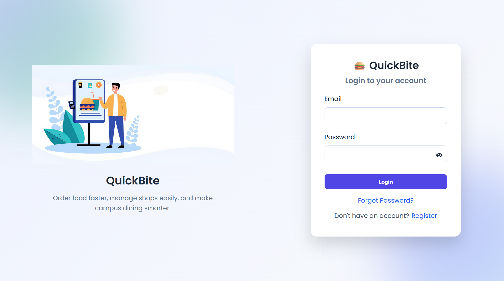

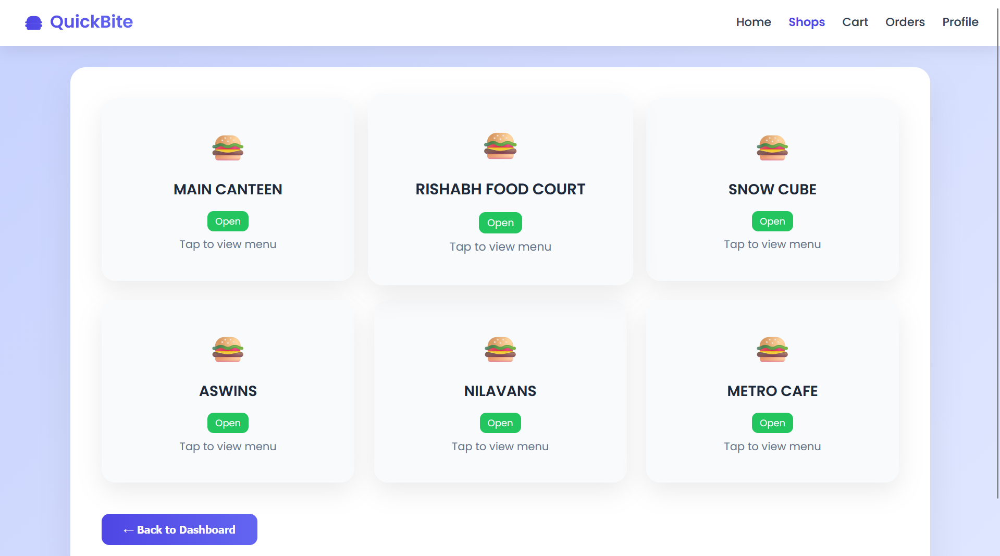

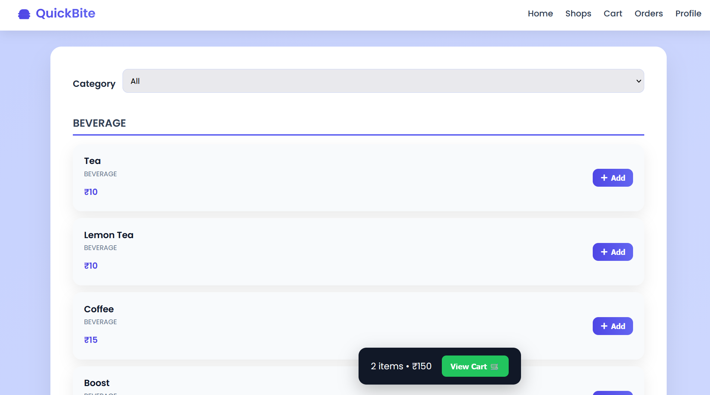

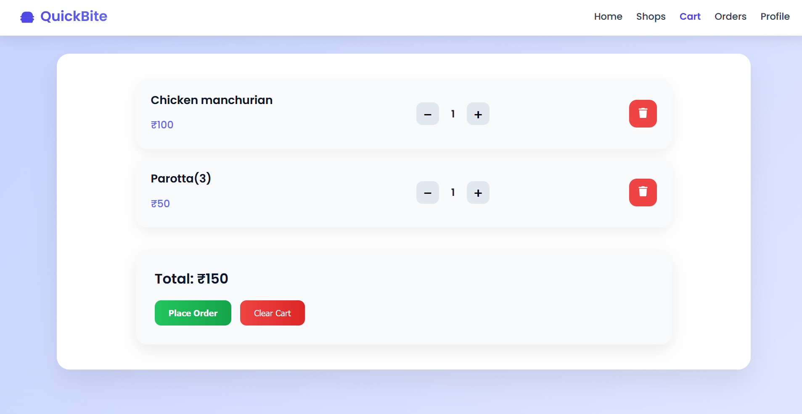

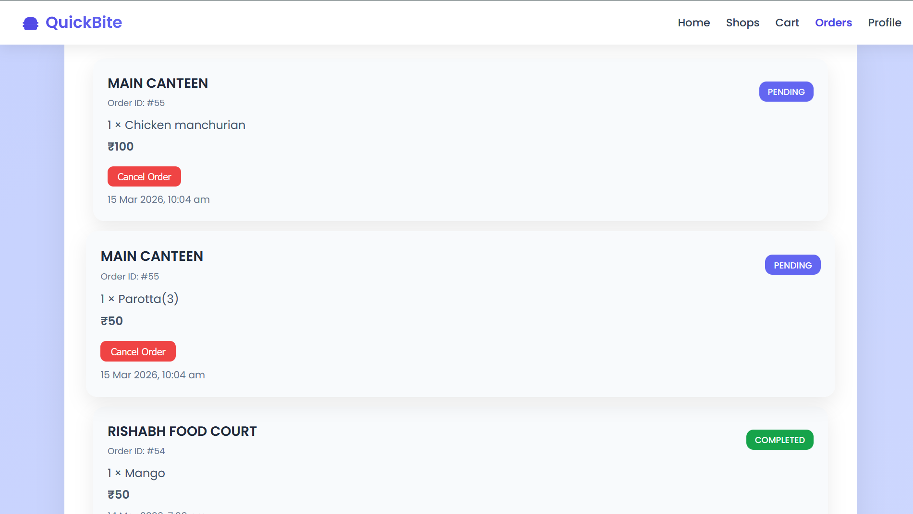

---

## 🏪 Shop Admin Dashboard

Shop administrators manage menus and handle incoming customer orders.

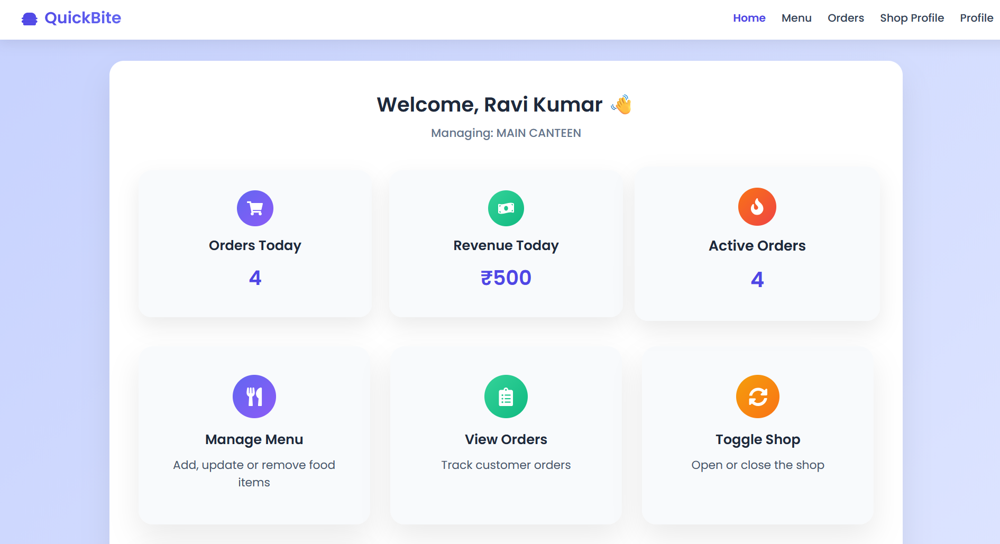

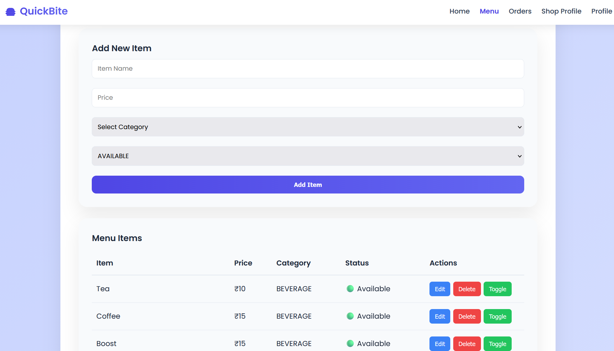

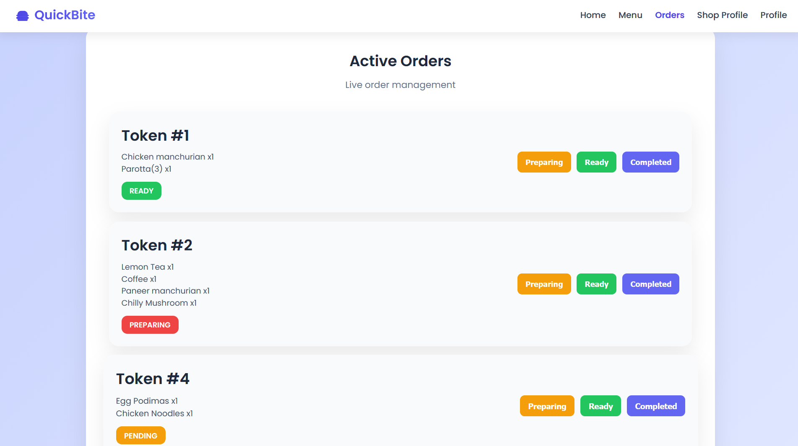

---

## ⚙️ System Admin Panel

The system administrator manages shops, users, and reports across the platform.

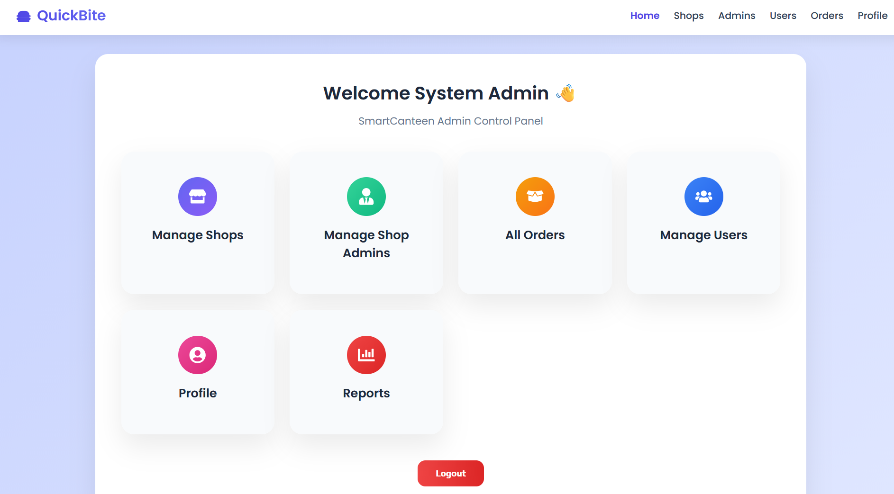

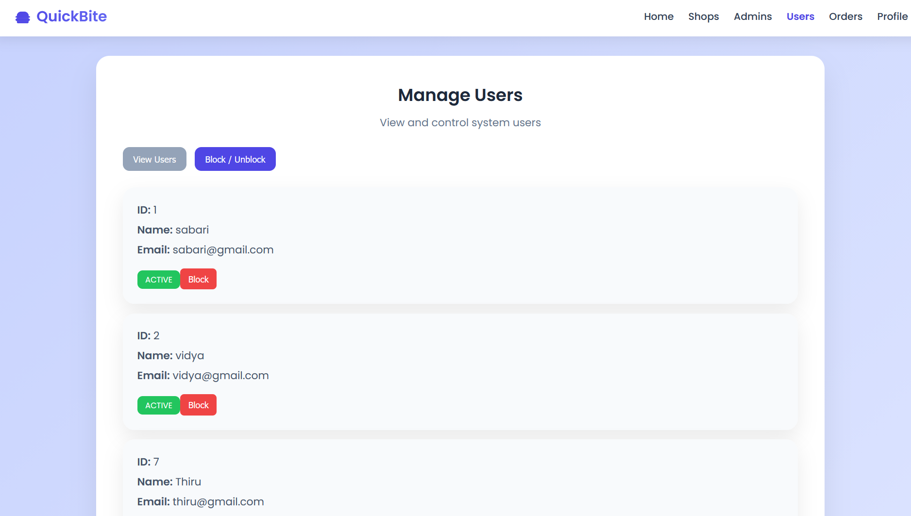

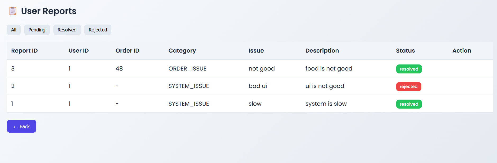

---

# 🎯 Project Goals

- Simplify campus food ordering
- Reduce waiting time in canteens
- Improve shop management efficiency
- Provide centralized administrative control

---

# 👨‍💻 Author

**Sabarithan P**
Aspiring Software Engineer | Full-Stack Developer
